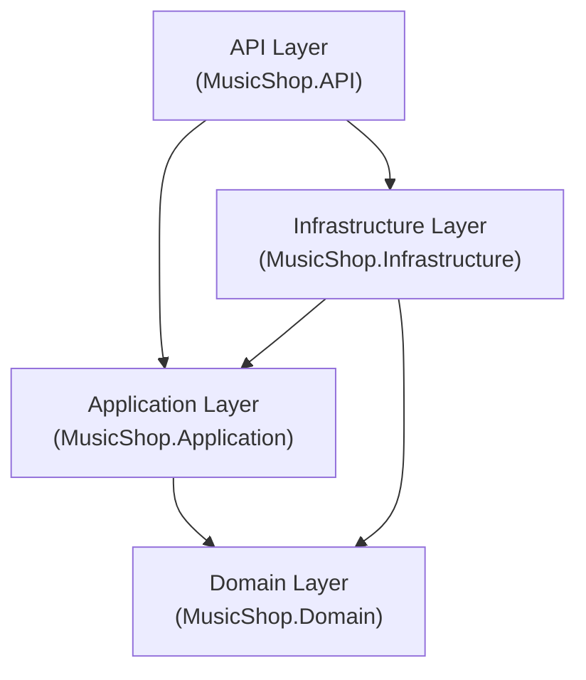
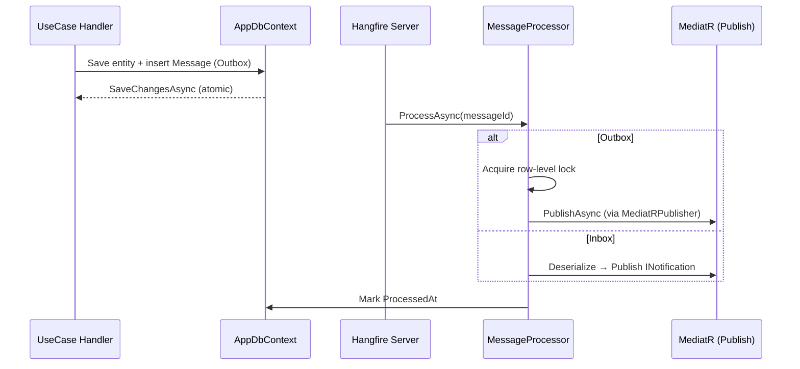
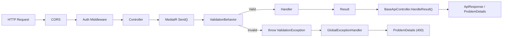

# MusicShop Backend — Architecture Analysis

## 1. High-Level Structure

Classic **Clean Architecture** with four layers and inward-facing dependencies:



| Layer | Target | NuGet Dependencies |
|---|---|---|
| **Domain** | `net10.0` | None (zero deps — correct) |
| **Application** | `net10.0` | MediatR 14.1, FluentValidation 12.1, EF Core 10 (abstractions), Google.Apis.Auth |
| **Infrastructure** | `net10.0` | EF Core 10 + Npgsql, Stripe.net, Hangfire, AWSSDK.S3, BCrypt, MailKit, CsvHelper |
| **API** | `net10.0` | Serilog, Swashbuckle, JwtBearer, Hangfire.AspNetCore |

---

## 2. Domain Layer

```
Domain/
├── Common/          BaseEntity, Result<T>, Error, ErrorType
├── Entities/
│   ├── Catalog/     Artist, Genre, Release, ReleaseVersion, Track, Label, join tables
│   ├── Shop/        Product, VinylAttributes, CdAttributes, CassetteAttributes, CuratedCollection
│   ├── Orders/      Cart, CartItem, Order, OrderItem, Payment
│   ├── Messaging/   Message (Outbox/Inbox)
│   └── System/      User, RefreshToken, AdminActivityLog
├── Enums/           OrderStatus, PaymentStatus, ProductType, ReleaseFormat, UserRole, PaymentGateway
├── Errors/          12 domain-specific error classes (ArtistErrors, OrderErrors, etc.)
└── Interfaces/      IRepository<T>, IUnitOfWork, ITokenService, IPasswordHasher, IRefreshTokenHasher
```

### Key observations

- **Result Pattern** — `Result` / `Result<T>` lives in Domain. No `Match` method — consumers use `IsSuccess`/`IsFailure` + `.Value` / `.Error`.
- **Error as Value Object** — `record Error(Code, Message, ErrorType)` with typed enum (`NotFound`, `Validation`, `Conflict`, `Unauthorized`, `Forbidden`).
- **BaseEntity** — `Guid Id`, `CreatedAt`, `UpdatedAt`. Public setters. No domain events collection.
- **Domain logic** — `Order.TransitionTo()` enforces a state machine via pattern matching. This is the only entity with meaningful domain behavior.
- **Generic IRepository** — defined in Domain with `GetByIdAsync`, `FirstOrDefaultAsync`, `GetByIdsAsync`, `AnyAsync`, `CountAsync`, `Add`, `Update`, `Delete`.

---

## 3. Application Layer

```
Application/
├── Common/
│   ├── Behaviors/     ValidationBehavior<TRequest, TResponse>
│   ├── Constants/     MessageTypes
│   ├── Interfaces/    19 specialized interfaces (repos, services)
│   ├── Mappings/      DTO mapping utilities
│   ├── Models/        Settings DTOs (EmailSettings, S3Settings, etc.)
│   └── Utils/         Utility helpers
├── DTOs/
│   ├── Auth/
│   ├── Catalog/
│   └── Shop/
├── Events/            OrderCreatedEvent, StripePaymentSucceededEvent
├── Handlers/          OrderCreatedHandler, StripePaymentSucceededHandler
├── UseCases/
│   ├── Auth/          Commands + Queries (login, register, refresh, Google OAuth)
│   ├── Catalog/       Artists, Genres, Labels, Releases, ReleaseVersions, CatalogSearch
│   ├── Shop/          Cart, Products, Orders, Payments, CuratedCollections
│   └── System/        Uploads
└── DependencyInjection.cs
```

### CQRS

Each use case follows the MediatR `IRequest<Result<T>>` → handler pattern, organized as:

```
UseCases/{Module}/{Entity}/
├── Commands/
│   ├── Create{Entity}/
│   │   ├── Create{Entity}Command.cs
│   │   ├── Create{Entity}CommandHandler.cs
│   │   └── Create{Entity}CommandValidator.cs
│   ├── Update{Entity}/
│   └── Delete{Entity}/
└── Queries/
    ├── Get{Entity}ById/
    └── GetAll{Entities}/
```

### Validation Pipeline

`ValidationBehavior` is a MediatR `IPipelineBehavior` that intercepts all requests, runs FluentValidation validators in parallel, and throws `ValidationException` on failures. The exception is caught by `GlobalExceptionHandler` in the API layer.

### Strategy Pattern — Order Status

Order status transitions use the Strategy pattern:

```
UpdateOrderStatus/
├── IOrderStatusAction.cs
├── Actions/
│   ├── ConfirmOrderAction.cs
│   ├── CancelOrderAction.cs
│   └── FulfillmentAction.cs
```

Registered as `IEnumerable<IOrderStatusAction>` in DI — the handler selects the appropriate action based on the target status.

---

## 4. Infrastructure Layer

```
Infrastructure/
├── Cache/            CacheService (IDistributedCache wrapper)
├── Messaging/        MediatRPublisher, MessageProcessor, MessagePollingJob, InboxHandler
├── Migrations/       EF Core migrations
├── Payments/         StripeService, StripeSettings, StripeServiceRegistration
├── Persistence/
│   ├── AppDbContext.cs
│   ├── UnitOfWork.cs
│   ├── Configurations/    5 IEntityTypeConfiguration files
│   ├── Repositories/      GenericRepository<T> + 9 specialized repos
│   └── SeedData/          CSV seed files + DbInitializer
├── Security/         JwtTokenService, PasswordHasher, RefreshTokenHasher, CurrentUserService, GoogleSettings
├── Services/         GmailEmailService, GoogleAuthService, HangfireJobService, PasswordHasher
└── Storage/          S3ImageService, S3Settings
```

### Persistence

- **PostgreSQL** via EF Core + Npgsql, using `pgvector` Docker image (vector search capability available).
- **Generic + Specialized Repositories** — `GenericRepository<T>` implements `IRepository<T>`. Domain-specific repos (e.g., `ProductRepository`, `ReleaseRepository`) extend the generic repo with custom queries.
- **UnitOfWork** — thin wrapper around `AppDbContext.SaveChangesAsync()`.
- **Configurations** — 5 files, grouped by bounded context (Catalog, Shop, Orders, Customer/System, Messaging).

### Messaging — Transactional Outbox/Inbox



- **Polling** — `MessagePollingJob` runs every 2 minutes via Hangfire recurring job.
- **Idempotency** — `ProcessedAt` null check + pessimistic row lock (`LockId`) via raw SQL `UPDATE ... WHERE LockId IS NULL`.
- **Retry** — Hangfire `[AutomaticRetry(Attempts = 5)]` with exponential backoff (10s → 300s).

### External Integrations

| Service | Implementation | Registration |
|---|---|---|
| Payments | Stripe.net | `AddStripeServices()` extension |
| Object Storage | AWS S3 | `IAmazonS3` via `AddAWSService<>()` |
| Email | MailKit (Gmail SMTP) | `IEmailService → GmailEmailService` |
| Auth | JWT + Google OAuth | Custom `JwtTokenService` + `GoogleAuthService` |
| Background Jobs | Hangfire + PostgreSQL | `AddHangfire()` + `AddHangfireServer()` |
| Caching | `IDistributedCache` (in-memory) | `AddDistributedMemoryCache()` |

---

## 5. API Layer

```
API/
├── Controllers/
│   ├── Base/BaseApiController.cs     Result<T> → ActionResult mapping
│   ├── ArtistsController.cs
│   ├── AuthController.cs
│   ├── CartController.cs
│   ├── CatalogController.cs
│   ├── CuratedCollectionsController.cs
│   ├── GenresController.cs
│   ├── LabelsController.cs
│   ├── OrdersController.cs
│   ├── PaymentsController.cs
│   ├── ProductsController.cs
│   ├── ReleaseVersionsController.cs
│   ├── ReleasesController.cs
│   └── UploadsController.cs
├── Infrastructure/
│   ├── ApiResponse.cs
│   ├── AuthorizeCheckOperationFilter.cs
│   └── HangfireAdminAuthorizationFilter.cs
├── Middleware/GlobalExceptionHandler.cs
└── Program.cs
```

### Request → Response Flow



### BaseApiController

Maps `Result<T>` to HTTP semantics:

| Error Type | HTTP Status |
|---|---|
| `NotFound` | 404 |
| `Unauthorized` | 401 |
| `Forbidden` | 403 |
| `Conflict` | 409 |
| `Validation` / `Failure` | 400 |

Returns RFC 7807 `ProblemDetails` for errors, wrapped `ApiResponse<T>` for success. Pagination support via `HandlePaginatedResult`.

### Pipeline Configuration

Middleware order in `Program.cs`:
1. ExceptionHandler
2. HTTPS Redirection
3. CORS (`FrontendPolicy` — `localhost:3000`, `localhost:5173`)
4. Security headers (`Cross-Origin-Opener-Policy`)
5. Authentication (JWT Bearer)
6. Authorization
7. Controllers
8. Hangfire Dashboard (`/hangfire`)

---

## 6. Deployment

Docker Compose with 3 services:

| Service | Image | Port |
|---|---|---|
| `postgres` | `ankane/pgvector:latest` | 5432 |
| `musicshop-api` | Custom Dockerfile | 5000 → 8080 |
| `musicshop-web` | Vite build (Nginx) | 3000 → 80 |

Environment variables injected from `.env` file.

---

## 7. Testing

```
tests/
├── MusicShop.Application.UnitTests/     xUnit + NSubstitute + FluentAssertions
└── MusicShop.IntegrationTests/          WebApplicationFactory<Program>
```

---

## 8. Architectural Observations

### What's working well

1. **Clean dependency flow** — Domain has zero NuGet deps. Application depends only on abstractions. Infrastructure implements everything.
2. **CQRS consistency** — Every use case follows the same Command/Query + Handler + Validator folder structure.
3. **Result pattern** — Business errors never throw. `Error` records are typed with `ErrorType`, mapped cleanly to HTTP status codes in `BaseApiController`.
4. **Transactional Outbox/Inbox** — Atomic writes with deferred processing. Row-level locking prevents double-processing in multi-instance deployments.
5. **Strategy pattern for Order transitions** — Open for extension, clean separation of side-effects per status.

### Areas to examine

| Area | Observation |
|---|---|
| **`BaseEntity` public setters** | `Id`, `CreatedAt`, `UpdatedAt` are publicly settable. Consider `init` or private setters to prevent accidental mutation. |
| **No Domain Events** | `BaseEntity` has no `DomainEvents` collection. The Outbox pattern compensates, but intra-aggregate side-effects (e.g., inventory adjustments on Order creation) require explicit coupling in handlers rather than reactive event dispatch. |
| **Application references EF Core** | `MusicShop.Application.csproj` has a direct `Microsoft.EntityFrameworkCore` dependency. This is likely for `IQueryable<T>` exposure in specialized repo interfaces. Violates strict Clean Architecture purity but is a common pragmatic trade-off. |
| **In-memory cache in production** | `AddDistributedMemoryCache()` is a no-op for multi-instance deployments. Swap to Redis (`AddStackExchangeRedisCache`) when scaling horizontally. |
| **`GlobalExceptionHandler` leaks exception messages** | `problemDetails.Detail = exception.Message` for 500s exposes internal details. Should use a generic message in non-Development environments. |
| **`CacheService` registered as Singleton** | Using `IDistributedCache` (thread-safe) is fine, but if swapped to a scoped implementation, the Singleton registration would cause captive dependency issues. |
| **API uses Controllers, not Minimal APIs** | Coding rules specify "Minimal APIs preferred". The project consistently uses Controllers — 13 of them. Not a bug, but a deviation from stated preference. |
| **`ValidationBehavior` throws exceptions** | Validation failures throw `ValidationException` which is caught by `GlobalExceptionHandler`. An alternative is returning `Result.Failure` from the behavior to avoid exception-driven control flow. |
| **`Google.Apis.Auth` in Application layer** | Third-party SDK dependency in Application. Consider moving `IGoogleAuthService` implementation entirely to Infrastructure. |
| **`MessageProcessor` uses raw SQL** | The `TryAcquireLockAsync` method uses `ExecuteSqlRawAsync` with parameterized inputs — safe from injection, but ties the implementation to PostgreSQL string-quoted identifiers. |
