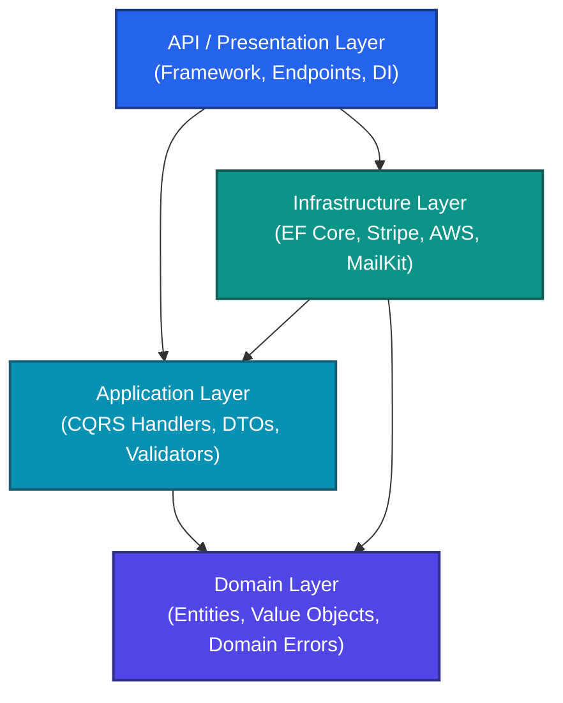

# Clean Architecture — Comprehensive Interview & Architectural Reference Guide

This document is a comprehensive guide designed for both interview preparation and practical reference. It explains the core concepts, layer-by-layer responsibilities, essential design patterns, and answers to common architectural interview questions with compile-ready, explicitly typed C# 12 examples.

---

## 1. High-Level Core Philosophy

Clean Architecture (closely related to **Onion Architecture** and **Hexagonal Architecture / Ports & Adapters**) is a software design pattern focused on the **Separation of Concerns** and **Dependency Isolation**. 

The fundamental goal is to decouple the core business logic from databases, frameworks, user interfaces, and external APIs.



### The Inward Dependency Rule
The defining rule of Clean Architecture is that **dependencies must point inward**.
*   **Inner layers** are completely unaware of outer layers.
*   **The Domain Layer** (innermost) knows nothing about Application, Infrastructure, or API layers.
*   **The Application Layer** knows only about the Domain.
*   **The Infrastructure and API Layers** know about both Application and Domain, but never reference concrete details of each other directly (they communicate via interfaces defined in inner layers).

### Four Key Benefits of Clean Architecture
1.  **Independent of Frameworks**: The core business rules are not bound to external frameworks (like EF Core, ASP.NET, or NestJS). You can swap frameworks without rewriting business logic.
2.  **Testable**: Business rules can be thoroughly unit-tested without databases, web servers, or third-party APIs.
3.  **Independent of the UI**: The UI can change easily (e.g., swapping a Web API for a gRPC service or Console App) without modifying the application logic.
4.  **Independent of the Database**: You can swap PostgreSQL for SQL Server or MongoDb without changing a single line of domain or application business logic.

---

## 2. Layer-by-Layer Breakdown

### A. The Domain Layer (Innermost Core)
The Domain layer represents the enterprise business rules and state. It must have **zero external dependencies** (no NuGet packages, no references to EF Core, API frameworks, etc.).

#### Key Components:
*   **Entities**: Classes representing domain objects with unique identities and mutable state (e.g., `User`, `Order`, `Release`).
*   **Value Objects**: Immutable objects without identities, defined solely by their attributes (e.g., `Money`, `Address`).
*   **Domain Errors**: Strongly-typed static error definitions representing business rule violations.
*   **Generic Interfaces**: Abstract contracts representing core domain capabilities (e.g., `IRepository<T>`, `IUnitOfWork`, `IPasswordHasher`) with zero dependencies on external libraries.

#### Clean Domain Code Example:
```csharp
namespace MusicShop.Domain.Entities.Catalog;

using MusicShop.Domain.Common;
using MusicShop.Domain.Errors;

public sealed class Artist : BaseEntity
{
    private Artist(Guid id, string name, string bio)
    {
        Id = id;
        Name = name;
        Bio = bio;
    }

    public string Name { get; private set; }
    public string Bio { get; private set; }

    // Factory method enforcing domain invariants
    public static Result<Artist> Create(Guid id, string name, string bio)
    {
        if (string.IsNullOrWhiteSpace(name))
        {
            return Result<Artist>.Failure(ArtistErrors.EmptyName);
        }

        return Result<Artist>.Success(new Artist(id, name, bio));
    }

    public void UpdateProfile(string name, string bio)
    {
        Name = name;
        Bio = bio;
    }
}
```

---

### B. The Application Layer (Use Cases)
The Application layer implements the specific business flows of the application (use cases). It references the **Domain** layer but is completely decoupled from database configurations, UI, or specific third-party client integrations.

#### Key Components:
*   **CQRS Use Cases**: Commands (write operations) and Queries (read operations).
*   **Handlers**: Logic classes implementing `IRequestHandler<TRequest, TResponse>` from MediatR.
*   **DTOs (Data Transfer Objects)**: Simple data contracts for returning data to the client.
*   **Validators**: FluentValidation schemas validating request properties before reaching the handler.
*   **Specialized Interfaces**: Custom application-level boundaries like `IEmailService`, `IStripeService`, or specific entity repositories (e.g., `IArtistRepository`).

#### Clean Application Code Example:
```csharp
namespace MusicShop.Application.UseCases.Catalog.Artists.Commands.CreateArtist;

using MediatR;
using MusicShop.Domain.Common;
using MusicShop.Domain.Entities.Catalog;
using MusicShop.Application.Common.Interfaces;

public sealed record CreateArtistCommand(string Name, string Bio) : IRequest<Result<Guid>>;

public sealed class CreateArtistCommandHandler : IRequestHandler<CreateArtistCommand, Result<Guid>>
{
    private readonly IArtistRepository _artistRepository;
    private readonly IUnitOfWork _unitOfWork;

    public CreateArtistCommandHandler(IArtistRepository artistRepository, IUnitOfWork unitOfWork)
    {
        _artistRepository = artistRepository;
        _unitOfWork = unitOfWork;
    }

    public async Task<Result<Guid>> Handle(CreateArtistCommand command, CancellationToken cancellationToken)
    {
        Guid newId = Guid.NewGuid();
        Result<Artist> artistResult = Artist.Create(newId, command.Name, command.Bio);

        if (artistResult.IsFailure)
        {
            return Result<Guid>.Failure(artistResult.Error);
        }

        Artist artist = artistResult.Value;
        await _artistRepository.AddAsync(artist, cancellationToken);
        await _unitOfWork.SaveChangesAsync(cancellationToken);

        return Result<Guid>.Success(artist.Id);
    }
}
```

---

### C. The Infrastructure Layer (Details)
The Infrastructure layer provides implementations for the interfaces defined in the core layers. It handles physical databases, message brokers, caching engines, and external API services.

#### Key Components:
*   **EF Core / Persistence**: `DbContext` definitions, entity configurations (`IEntityTypeConfiguration<T>`), and repository implementations.
*   **External Service Integrations**: Integrations with Stripe (Payments), S3 (File Storage), MailKit (Emails), or AWS.
*   **Security & Caching**: Implementations of token generation, password hashing, and Redis/In-Memory caching.

#### Clean Infrastructure Code Example:
```csharp
namespace MusicShop.Infrastructure.Persistence.Repositories;

using Microsoft.EntityFrameworkCore;
using MusicShop.Domain.Entities.Catalog;
using MusicShop.Application.Common.Interfaces;

public sealed class ArtistRepository : IArtistRepository
{
    private readonly AppDbContext _context;

    public ArtistRepository(AppDbContext context)
    {
        _context = context;
    }

    public async Task<Artist?> GetByIdAsync(Guid id, CancellationToken cancellationToken)
    {
        return await _context.Set<Artist>()
            .AsNoTracking()
            .FirstOrDefaultAsync(artist => artist.Id == id, cancellationToken);
    }

    public async Task AddAsync(Artist artist, CancellationToken cancellationToken)
    {
        await _context.Set<Artist>().AddAsync(artist, cancellationToken);
    }
}
```

---

### D. The API / Presentation Layer (Entry Point)
The Presentation layer is the application's entry point. It hosts endpoints, handles routing, serializes/deserializes JSON payloads, and handles authorization middleware.

#### Key Components:
*   **Controllers or Minimal APIs**: Route triggers that delegate execution immediately to MediatR via `mediator.Send(command)`. They must contain **zero business logic**.
*   **Global Exception Handling**: Custom middlewares converting exceptions into standard RFC 7807 `ProblemDetails` responses.
*   **Dependency Injection (DI)**: The composition root where concrete Infrastructure classes are registered to satisfy Domain and Application interfaces.

#### Clean API Code Example:
```csharp
namespace MusicShop.API.Controllers;

using MediatR;
using Microsoft.AspNetCore.Mvc;
using MusicShop.API.Controllers.Base;
using MusicShop.Application.UseCases.Catalog.Artists.Commands.CreateArtist;

[ApiController]
[Route("api/v1/artists")]
public sealed class ArtistsController : BaseApiController
{
    private readonly ISender _sender;

    public ArtistsController(ISender sender)
    {
        _sender = sender;
    }

    [HttpPost]
    public async Task<IActionResult> CreateArtist([FromBody] CreateArtistCommand command, CancellationToken cancellationToken)
    {
        Result<Guid> result = await _sender.Send(command, cancellationToken);
        
        return result.Match(
            id => CreatedAtAction(nameof(GetArtistById), new { id }, id),
            error => HandleError(error)
        );
    }

    [HttpGet("{id:guid}")]
    public Task<IActionResult> GetArtistById(Guid id, CancellationToken cancellationToken)
    {
        // Query implementation...
        return Task.FromResult<IActionResult>(Ok());
    }
}
```

---

## 3. Essential Architectural Patterns

### A. Dependency Inversion Principle (DIP)
Dependency Inversion dictates that high-level modules should not depend on low-level modules; both must depend on abstractions. 

In Clean Architecture:
*   `MusicShop.Application` (high-level use case) needs to save an Artist.
*   It defines an abstraction: `IArtistRepository` interface.
*   `MusicShop.Infrastructure` (low-level detail) references `MusicShop.Application` and implements `IArtistRepository` via EF Core's `AppDbContext`.
*   During runtime, DI injects `ArtistRepository` into `CreateArtistCommandHandler`. The handler is completely insulated from database implementation changes.

### B. Command Query Responsibility Segregation (CQRS)
CQRS separates write operations (Commands) from read operations (Queries).
*   **Commands**: Perform actions that change system state (e.g., `CreateArtistCommand`, `CancelOrderCommand`). They return `Result` or `Result<T>` containing a key or status.
*   **Queries**: Fetch data without modifying state (e.g., `GetArtistByIdQuery`, `GetProductCatalogQuery`). They should use `AsNoTracking()` in EF Core to bypass change-tracking overhead.

### C. The Result Pattern
Exceptions should only represent exceptional, unexpected system behavior (e.g., network failure, database down). Business rule violations (e.g., `Product.OutOfStock`, `InvalidPromoCode`) are normal, expected occurrences. 

Instead of throwing costly exceptions, Clean Architecture uses a **Result Pattern** to represent success or failures as strongly typed values.
```csharp
public sealed record Error(string Code, string Description, ErrorType Type);

public class Result<TValue>
{
    private Result(TValue value)
    {
        IsSuccess = true;
        Value = value;
        Error = null;
    }

    private Result(Error error)
    {
        IsSuccess = false;
        Value = default!;
        Error = error;
    }

    public bool IsSuccess { get; }
    public bool IsFailure => !IsSuccess;
    public TValue Value { get; }
    public Error? Error { get; }

    public static Result<TValue> Success(TValue value) => new(value);
    public static Result<TValue> Failure(Error error) => new(error);
}
```

### D. Transactional Outbox Pattern
To prevent distributed transaction failures (e.g., database succeeds, but message broker / email service fails), we write both the core entity changes and an "Outbox Message" record in the same atomic database transaction. 

A background worker (like Hangfire or an Hosted Service) then polls the database periodically to process and send these outbox messages reliably.

---

## 4. Top 5 Interview Questions & Core Model Answers

### Question 1: What is the difference between Clean Architecture, Onion Architecture, and Hexagonal Architecture?
> **Model Answer:**
> "Structurally and philosophically, they are virtually identical. They all share the same objective: **separating core business logic from delivery mechanisms, frameworks, and databases** using the **Dependency Inversion Principle**. 
> 
> *   **Hexagonal Architecture (Ports & Adapters)** represents this using the concept of **Ports** (interfaces defined by the core) and **Adapters** (external integrations that plug into ports).
> *   **Onion Architecture** formalizes this concentric layering, emphasizing that the Domain core is at the center, surrounded by Application Services, with Infrastructure on the outer rings.
> *   **Clean Architecture** (popularized by Robert C. Martin) unifies these paradigms. It introduces a highly structured layered diagram (Domain, Application, Interface Adapters, Frameworks) and emphasizes the **Dependency Rule** where all code dependencies must point exclusively inward."

---

### Question 2: The Domain layer cannot reference external packages. How do you save domain aggregates to the database without referencing EF Core?
> **Model Answer:**
> "We achieve this via **Dependency Inversion**. 
> 
> 1. We declare generic interfaces like `IRepository<T>` and specialized contracts like `IArtistRepository` inside either the **Domain** or **Application** layer.
> 2. The Domain entities are pure C# classes with private setters to control access and protect business rules (invariants).
> 3. In the **Infrastructure** layer, we reference EF Core, map the domain models to tables using `IEntityTypeConfiguration<T>`, and implement the repository interfaces.
> 4. At application startup, the dependency injection container registers the infrastructure repository class as the concrete implementation of the domain/application interface.
> 
> This isolates the Domain layer from the database framework entirely. If we swap EF Core for Dapper or MongoDB, we only change the Infrastructure implementation; the core business logic remains untouched."

---

### Question 3: Where should interfaces be defined: the Domain Layer or the Application Layer?
> **Model Answer:**
> "It depends on the interface's **dependencies** and **semantic role** in the system:
> 
> 1. **Domain Layer**: We place **Generic Abstractions** and contracts for **Domain Services** that require **zero external dependencies** here. Examples include `IRepository<T>`, `IUnitOfWork`, or core domain concepts like `IPasswordHasher`. Placing them here allows the Domain layer to remain self-contained while specifying the core contracts it relies on.
> 2. **Application Layer**: We place **Specialized Abstractions** and contracts for **External Integrations** here. Examples include `IEmailService`, `IStripeService` (Payments), `IImageService` (AWS S3), or `ICurrentUserService`. The core Domain should not be polluted with technical details like sending emails, processing payments, or HTTP web contexts."

---

### Question 4: How do you handle request validation in Clean Architecture?
> **Model Answer:**
> "Validation is handled systematically across three stages, depending on the context:
> 
> 1. **Application Layer Input Validation (FluentValidation)**: Before a CQRS command reaches its handler, we use an ASP.NET pipeline behavior (`IPipelineBehavior` in MediatR) to intercept the request and validate constraints (e.g., checking if an email is well-formed or a field is within valid length). If validation fails, we interrupt the pipeline and immediately return or throw a validation result.
> 2. **Domain Layer Business Rule Validation**: Inside the domain entities or domain services, we enforce business invariants. This is typically done using **Factory Methods** (e.g., `Artist.Create()`) that return a `Result<T>` instead of public constructor instantiation. This guarantees that an entity cannot exist in an invalid state.
> 3. **Infrastructure Layer Data Constraints**: Database schema constraints like unique indexes or foreign keys act as our final line of defense against data corruption."

---

### Question 5: What are the main drawbacks and trade-offs of Clean Architecture?
> **Model Answer:**
> "While Clean Architecture is exceptional for complex, long-term enterprise systems, it does introduce specific trade-offs:
> 
> 1. **Boilerplate & Complexity**: Adding a simple feature requires writing multiple files across different projects: a Domain Entity, a Repository Interface, a Repository Implementation, a Command, a Command Handler, a Validator, a DTO, and an API endpoint.
> 2. **Mapping Overhead**: Because layers are isolated, we frequently map data from Database Models (EF Core entities) to Domain Entities, and then to Application DTOs. This mapping overhead requires significant boilerplate or dependencies like AutoMapper.
> 3. **Performance Overhead**: In highly optimized read paths, passing queries through repository wrappers, mapping layers, and MediatR handlers can introduce slight overhead. To mitigate this, we can bypass repositories in read paths and query DTOs directly using Dapper or EF Core with `AsNoTracking()`.
> 
> Therefore, Clean Architecture is **overkill for simple CRUD apps or microservices** with small codebases, where a simpler Transaction Script or Active Record pattern is more efficient."
