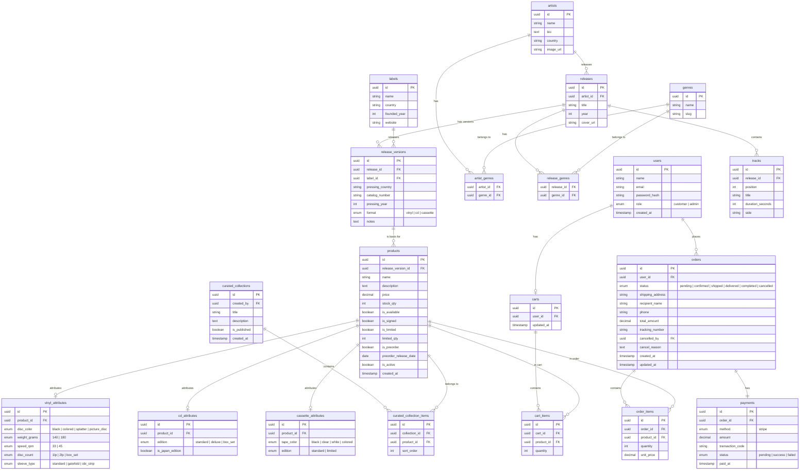

# ERD Analysis — Vinyl Shop

## General Conventions

| Symbol | Meaning |
|---|---|
| `PK` | Primary Key — Unique identifier for each row |
| `FK` | Foreign Key — Reference to another table |
| `uuid` | Universally Unique Identifier, safer than auto-incrementing integers |
| `enum` | Fixed set of values, e.g., `vinyl / cd / cassette` |
| `unique` | Cannot be duplicated within the table |
| `nullable` | Allows empty values |

---

## Candidate Entity Analysis from Overview

Source: `docs/overview.md`. Bold terms in the overview are treated as entity-candidate keywords, then classified into tables, enums/value objects, query concepts, or side effects.

### Accepted Entity Candidates

| Overview candidate keyword | ERD decision | Reason |
|---|---|---|
| **User**, **Customer**, **Admin** | `users` table + `role` enum | Customer/Admin are roles of a registered user, not separate tables. |
| **Artist** | `artists` table | Independently managed catalog entity with biography, country, image, and release relationships. |
| **Genre** | `genres` table + junction tables | Reused by many artists/releases; needs canonical names and slugs. |
| **Album**, **Single**, **EP**, **Original Release** | `releases` table | These are release types/semantic categories of the same catalog concept. |
| **Edition**, **Pressing**, **Specific Edition** | `release_versions` table | Physical releases can have many country/year/label/catalog-number variants. |
| **Track**, **Tracklist** | `tracks` table | Track ordering and duration belong to a release. |
| **Record Label**, **Label** | `labels` table | Label data is reused by many release versions. |
| **Product**, **Physical Media** | `products` table | Sellable SKU with price, stock, availability, preorder/limited flags. |
| **Vinyl**, **CD**, **Cassette**, **Attributes** | `vinyl_attributes`, `cd_attributes`, `cassette_attributes` | Format-specific attributes differ enough to deserve separate structures. |
| **Curated Collection**, **Collection** | `curated_collections`, `curated_collection_items` | Admin-managed product groupings with ordering. |
| **Cart** | `carts`, `cart_items` | Customer shopping state with multiple products and quantities. |
| **Order** | `orders`, `order_items` | Checkout creates a durable order snapshot and item snapshot. |
| **Payment**, **Transaction**, **Stripe** | `payments` table | Payment status and external transaction code must be stored for reconciliation. |
| **Business Events** | `messages` table | Reliable outbox/inbox processing is an infrastructure persistence concern. |
| **Action Logs** | `admin_activity_logs` table | Admin audit trail is stored separately from business entities. |
| **Login / Logout**, **Google Auth** | `refresh_tokens` table | Long-lived auth sessions require persisted hashed refresh tokens. |

Note: The detailed sections below focus on storefront/business ERD tables. Support tables such as `refresh_tokens`, `admin_activity_logs`, and `messages` are acknowledged here because the overview implies them, but they are not expanded in the core business ERD section.

### Non-Entity or Deferred Candidates

| Overview candidate keyword | ERD decision | Reason |
|---|---|---|
| **Guest** | No table | Guest is an unauthenticated request state, not persisted. |
| **Role** | Enum/value | Only fixed roles are needed: customer/admin. No role-management feature exists. |
| **Format**, **Product Type**, **Payment Method**, **Order Status**, **Payment Status** | Enum/value | Closed value sets used for validation and branching. |
| **Country**, **Price**, **Decade**, **Release Date**, **Stock**, **Inventory** | Fields or derived filters | These describe entities; they are not independent lifecycle objects in this system. |
| **Catalog**, **Music Catalog** | Module/bounded context | Organizes related entities but does not become a table. |
| **Revenue Reports** | Query/report model | Revenue is calculated from orders/payments; no separate report table is required. |
| **Notifications**, **Emails**, **Notification History** | Side effect, no table | Current design sends email from application handlers and does not store notification logs. |
| **Review** | Deferred candidate | Mentioned in overview, but no current review entity/table exists. Add only if product reviews become an implemented feature. |
| **Wantlist** | Removed/deferred candidate | Mentioned in inventory rules, but current model has no wantlist table. Reintroduce only if back-in-stock notification becomes a feature. |

---

## Section 1 — User Roles

**Number of entities: 1**

### `users` — Users

Stores information for all registered users. Guests do not have a row in the DB — they exist at the session/request layer, not the data layer.

```
users
─────────────────────────────────────────
id            | uuid        PK
name          | string
email         | string      unique
password_hash | string      nullable    -- null if using Google Login
auth_provider | enum        -- local | google
provider_id   | string      nullable    -- ID from Google (sub)
role          | enum        -- customer | admin
created_at    | timestamp
```

**Field explanations:**

- `auth_provider` defaults to `local`. If using Google, `password_hash` will be empty.
- `provider_id` stores the unique identifier from Google (subject) to avoid total dependence on email (which can change).
- `role` has only 2 values because Guests do not exist in the DB. A Guest's entire set of permissions is "no JWT" — handled at the API layer, not the schema.
- `password_hash` — stores the result of hashing (bcrypt/argon2), never plain text passwords. Even admins cannot read the actual password.
- No separate `roles` or `permissions` tables are needed because the system has only 2 fixed roles with static permissions. Adding more tables would be over-engineering.

**Relationships with other tables:**

```
users ──< orders
users ──| carts (1-1)
```

---

## Section 2 — Music Catalog

**Number of entities: 6 + 2 junction tables = 8 tables**

The Catalog is a pure music database — completely separate from sales logic. It serves as the foundation for AI operations and accurate product information management.

Data hierarchy:

```
Artist → Release → ReleaseVersion → Product (Section 3)
                └→ Track
Label  → ReleaseVersion
Genre  ↔ Artist (many-to-many)
Genre  ↔ Release (many-to-many)
```

---

### `artists` — Artists

Stores information about people/bands. An artist can have multiple albums and multiple genres.

```
artists
─────────────────────────────────────────
id        | uuid     PK
name      | string               -- "Pink Floyd", "Miles Davis"
slug      | string               -- "pink-floyd"
bio       | text     nullable    -- long biography, using text instead of string
country   | string   nullable    -- "UK", "US" — used for product filtering
image_url | string   nullable    -- stores path, doesn't store files in DB
```

**Explanations:**

- `bio` uses the `text` type instead of `string` (varchar) because biographies can be very long and should not be limited in length.
- `image_url` stores the path to the image file (S3, CDN...). The DB does not store binary files because it increases DB size, slows down backups, and makes queries heavy.
- `country` is stored directly instead of being separated into a `countries` table because there is no business requirement to manage a list of countries — it is only used for filtering.

---

### `genres` — Music Genres

Standardized list of music genres. Separated into its own table to avoid typos and for centralized management.

```
genres
─────────────────────────────────────────
id   | uuid     PK
name | string   unique    -- "Progressive Rock" — display name
slug | string   unique    -- "progressive-rock" — used for URLs and filtering
```

**Explanations:**

- `name` must be `unique` to prevent "Rock" and "rock" from coexisting.
- `slug` is a URL-safe version of the name — no spaces, no special characters. Used when filtering `/products?genre=progressive-rock`. The frontend does not need to encode spaces.
- Reason for a separate table instead of storing directly in `artists`: if you store `genres = "Rock"` directly in `artists`, when you want to rename the genre or add a slug, you have to update all related rows. With a separate table, you only update 1 row in `genres`.

---

### `releases` — Original Releases

Artistic information of an album/EP/single. This is the "original" — before considering where it was pressed, in what year, or by which label.

```
releases
─────────────────────────────────────────
id          | uuid     PK
artist_id   | uuid     FK → artists.id
title       | string               -- "Dark Side of the Moon"
slug        | string               -- SEO / URL friendly
description | text     nullable    -- General introduction to the album
year        | int                  -- 1973 — original release year
cover_url   | string   nullable    -- original cover art
```

**Explanations:**

- `year` is the original release year, not the repressing year. The repressing year is in `release_versions.pressing_year`.
- Why separate `releases` from `release_versions`? An album can have dozens of repressings in many countries. If merged, artistic information (name, year, tracklist) would be repeated dozens of times. By separating them, artistic info is stored once, and pressing versions only store physical info.

---

### `release_versions` — Specific Versions

Each time an album is pressed, it is a separate `release_version`. This is the entity that links directly to `products`.

```
release_versions
─────────────────────────────────────────
id               | uuid     PK
release_id       | uuid     FK → releases.id
label_id         | uuid     FK → labels.id
pressing_country | string   nullable    -- "US", "Japan", "UK"
catalog_number   | string   nullable    -- "SHVL 804" — label's catalog code
pressing_year    | int      nullable    -- 1973, 1976, 2011
format           | enum                 -- vinyl | cd | cassette
notes            | text     nullable    -- "First UK pressing", "OBI strip"
```

**Explanations:**

- `catalog_number` is the identifier set by the label, used for lookup and authenticity verification. Important for collectors.
- `format` is here because format is an attribute of the pressing — Japan OBI 1976 defines it as Vinyl, not CD. This is the source of truth for format.
- `notes` uses free text instead of an enum because version characteristics are very diverse and hard to list exhaustively beforehand.

**Real-world example — same release, 3 versions:**

| pressing_country | pressing_year | label | notes |
|---|---|---|---|
| US | 1973 | Harvest | First US pressing |
| Japan | 1976 | Toshiba EMI | OBI strip |
| UK | 2011 | Parlophone | 2011 Remaster |

Three rows in `release_versions`, only 1 row in `releases`.

---

### `labels` — Record Labels

The company that releases the record. A label can release many versions of many different albums.

```
labels
─────────────────────────────────────────
id           | uuid     PK
name         | string               -- "Harvest Records", "Toshiba EMI"
country      | string               -- "UK", "Japan"
founded_year | int      nullable
website      | string   nullable
```

**Explanations:**

- Why is `labels` its own entity instead of storing the label name directly in `release_versions`? Because many `release_versions` share the same label. "Harvest Records" has released hundreds of albums. If storing the name directly, when you need to add info about the label (website, country), you have to update hundreds of rows. By separating it, you only update 1 row in `labels`.

---

### `tracks` — Tracklist

Tracklist of an album. Attached to `releases` — not to `release_versions` because different pressings still have the same original tracklist.

```
tracks
─────────────────────────────────────────
id               | uuid     PK
release_id       | uuid     FK → releases.id
position         | int                  -- track order: 1, 2, 3...
title            | string               -- "Speak to Me", "Breathe"
duration_seconds | int                  -- 168
side             | string   nullable    -- "A", "B" — for vinyl
```

**Explanations:**

- `duration_seconds` stores an integer instead of a string `"3:20"` because it's easier to calculate total album duration, sort, and filter. Displaying `"3:20"` is the frontend's job — `Math.floor(168/60) + ":" + (168%60)`.
- `side` is used for vinyl with Side A and Side B. Tracks 1-6 on Side A, tracks 7-12 on Side B. For CDs and cassettes, `side = null`.
- Why attach to `releases` instead of `release_versions`? Because the tracklist is artistic info and does not change with the pressing. Japan OBI 1976 and US First Press 1973 have the same tracklist.

---

### Junction table: `artist_genres`

Links `artists` and `genres` in a many-to-many relationship. One artist has many genres, and one genre has many artists.

```
artist_genres
─────────────────────────────────────────
artist_id | uuid     FK → artists.id
genre_id  | uuid     FK → genres.id
─────────────────────────────────────────
PRIMARY KEY (artist_id, genre_id)         -- composite key, no separate id needed
```

---

### Junction table: `release_genres`

Links `releases` and `genres`. Separate from `artist_genres` because a release can sometimes belong to a different genre than the artist.

```
release_genres
─────────────────────────────────────────
release_id | uuid     FK → releases.id
genre_id   | uuid     FK → genres.id
─────────────────────────────────────────
PRIMARY KEY (release_id, genre_id)
```

**Why separate from `artist_genres`?**

Miles Davis is Jazz, but the album *Bitches Brew* is Jazz Fusion — a specific genre for that release that doesn't represent the entire artist. If merged, it would be impossible to distinguish "artist's genre" from "this specific album's genre".

---

## Section 3 — Products & Sales

**Number of entities: 7 (including 1 junction table + 3 attribute tables)**

This section is the bridge between the music catalog and the sales system.

```
release_versions → products
                        ↑
              (Price and stock live here)
```

---

### `products` — Products

A `product` represents a `release_version` that the shop is selling. Currently, each Product is an independent SKU.

```
products
─────────────────────────────────────────
id                   | uuid     PK
release_version_id   | uuid     FK → release_versions.id
name                 | string               -- display name in shop
slug                 | string               -- SEO / URL friendly
cover_url            | string   nullable    -- original product image
description          | text     nullable
price                | decimal              -- sale price
stock_qty            | int      default 0   -- stock quantity
is_available         | boolean  default true-- sales status
is_signed            | boolean  default false-- signed copy or not
is_limited           | boolean  default false
limited_qty          | int      nullable
is_preorder          | boolean  default false
preorder_release_date| date     nullable
is_active            | boolean  default true-- hide/show product
created_at           | timestamp
```

**Explanations:**

- `price` and `stock_qty` are now stored directly in `products`. The system has removed the Variant layer to simplify SKU management.
- `Format` is no longer in the `products` table. This information is retrieved directly from `release_versions.format` to ensure data consistency (Single Source of Truth).
- Specific attributes for each format (disc color, weight...) are separated into 3 extension tables (`vinyl_attributes`, `cd_attributes`, `cassette_attributes`) and linked directly to `product_id`.
- `is_active = false` is used when hiding a product instead of deleting it — products should not be deleted when there are Pending/Confirmed orders.

---

**Relationship with extension tables (1-1):**

```
products ──| vinyl_attributes
products ──| cd_attributes
products ──| cassette_attributes
```

A product belongs to exactly 1 format, so only 1 corresponding extension table exists.

---

### `vinyl_attributes` — Vinyl Attributes

```
vinyl_attributes
─────────────────────────────────────────
id                 | uuid   PK
product_id         | uuid   FK → products.id   unique
disc_color         | enum   -- black | colored | splatter | picture_disc
weight_grams       | enum   -- 140 | 180
speed_rpm          | enum   -- 33 | 45
disc_count         | enum   -- 1lp | 2lp | box_set
sleeve_type        | enum   -- standard | gatefold | obi_strip
```

**Explanations:**

- `unique` on `product_id` enforces a 1-1 relationship — a product cannot have 2 vinyl_attributes rows.
- All use `enum` instead of free `string` so the DB rejects invalid values. You cannot store `weight_grams = "180g"` (string) or `speed_rpm = 78` (invalid).
- `disc_count` distinguishes between 1LP, 2LP, Box set.

---

### `cd_attributes` — CD Attributes

```
cd_attributes
─────────────────────────────────────────
id                 | uuid    PK
product_id         | uuid    FK → products.id   unique
edition            | enum    -- standard | deluxe | box_set
is_japan_edition   | boolean default false
```

**Explanations:**

- `edition` distinguishes between Standard (original tracklist) and Deluxe/Expanded (with bonus tracks).
- `is_japan_edition` is a separate boolean because Japan editions are a specific concept in the music market — often featuring exclusive bonus tracks, OBI strips, higher prices, and are specifically sought after by collectors.

---

### `cassette_attributes` — Cassette Attributes

```
cassette_attributes
─────────────────────────────────────────
id                 | uuid   PK
product_id         | uuid   FK → products.id   unique
tape_color         | enum   -- black | clear | white | colored
edition            | enum   -- standard | limited
```

**Explanations:**

- `tape_color` is an important visual attribute for cassette collectors — tape color directly affects price and rarity.
- `edition = limited` combined with `products.is_limited` for a double-check: `is_limited` is a business rule (selling limit), `edition` is the manufacturer's marketing info.

---

### `curated_collections` — Themed Collections

Admins create editorial collections to group products by theme. E.g., *Horror Soundtracks*, *Vietnam New Wave*.

```
curated_collections
─────────────────────────────────────────
id           | uuid     PK
created_by   | uuid     FK → users.id    -- must be an admin
title        | string                    -- "Horror Soundtracks"
description  | text     nullable
is_published | boolean  default false    -- draft before publishing
created_at   | timestamp
```

**Explanations:**

- `is_published` allows admins to prepare a collection and publish it when ready, rather than displaying it immediately upon creation.
- `created_by` tracks which admin created it, used for audit logs.

---

### Junction table: `curated_collection_items`

Links `curated_collections` and `products`. A collection has many products, and a product can appear in many collections.

```
curated_collection_items
─────────────────────────────────────────
id            | uuid     PK
collection_id | uuid     FK → curated_collections.id
product_id    | uuid     FK → products.id
sort_order    | int                  -- display order in collection
```

**Explanations:**

- Uses a separate `id` instead of a composite key because there is an additional `sort_order` — a composite key cannot describe order.
- `sort_order` allows admins to arrange products in a collection as desired, independent of insertion order.

---

## Section 4 — Order Process

**Number of entities: 5**

Order Lifecycle:

```
Pending → Confirmed → Shipped → Delivered → Completed
             ↓
          Cancelled
```

---

### `carts` — Shopping Carts

Each customer has exactly 1 shopping cart. The cart is persistent (not lost when closing the tab).

```
carts
─────────────────────────────────────────
id         | uuid     PK
user_id    | uuid     FK → users.id    unique    -- 1 user only has 1 cart
updated_at | timestamp
```

**Explanations:**

- `user_id` has a `unique` constraint to ensure a user has exactly 1 cart.
- `total` is not stored in `carts` because the total amount is always calculated dynamically from `cart_items` — avoiding data discrepancy when prices change.
- Guests do not have a cart in the DB — if needed, store temporarily in localStorage on the frontend.

---

### `cart_items` — Cart Items

```
cart_items
─────────────────────────────────────────
id                 | uuid     PK
cart_id            | uuid     FK → carts.id
product_id         | uuid     FK → products.id
quantity           | int      default 1
```

---

### `orders` — Orders

```
orders
─────────────────────────────────────────
id               | uuid     PK
user_id          | uuid     FK → users.id
status           | enum               -- pending | confirmed | shipped | delivered | completed | cancelled
shipping_address | string             -- shipping address (snapshot at time of order)
recipient_name   | string             -- recipient name (snapshot)
phone            | string             -- phone number (snapshot)
note             | text    nullable   -- customer note when ordering
total_amount     | decimal            -- total amount (snapshot at time of order)
tracking_number  | string  nullable   -- tracking code, available after shipping
cancelled_by     | uuid    nullable   FK → users.id   -- who cancelled the order
cancel_reason    | text    nullable
created_at       | timestamp
updated_at       | timestamp
```

**Explanations:**

- `shipping_address`, `recipient_name`, `phone` are snapshots — copied from the user profile at the time of order. If the user changes their address later, old orders are not affected.
- `total_amount` is also a snapshot — the total at the time of ordering. It is not recalculated from `order_items` later because prices may have changed.
- `cancelled_by` records who cancelled — customer or admin — for audit logs and reporting.
- `tracking_number` only has a value after the order moves to the `shipped` status.

**Cancellation Rules:**

| Status | Customer | Admin |
|---|---|---|
| Pending | Allowed | Allowed |
| Confirmed onwards | Not Allowed | Allowed |

---

### `order_items` — Order Details

```
order_items
─────────────────────────────────────────
id                 | uuid     PK
order_id           | uuid     FK → orders.id
product_id         | uuid     FK → products.id
quantity           | int
unit_price         | decimal              -- price snapshot at time of order
```

**Explanations:**

- `unit_price` is a snapshot of the price at the time of ordering.
- `product_id` holds an FK to look up product info (name, image) when displaying order history.

---

## Section 5 — Payments

**Number of entities: 1**

### `payments` — Payments

Each order has exactly 1 payment (1-1 relationship with `orders`).

```
payments
─────────────────────────────────────────
id               | uuid     PK
order_id         | uuid     FK → orders.id    unique    -- 1 order only has 1 payment
method           | enum               -- stripe
amount           | decimal            -- payment amount
transaction_code | string  nullable   -- transaction code from Stripe (Session ID / Payment Intent ID)
status           | enum               -- pending | success | failed
paid_at          | timestamp nullable -- time of successful payment
```

**Explanations:**

- `order_id unique` enforces a 1-1 relationship — 1 order cannot have 2 payment records.
- `transaction_code` is the PaymentIntent ID or Session ID from Stripe.
- `paid_at` is the time the webhook receives the Stripe success notification.
- `status = pending` until Stripe finishes processing the payment and the webhook pushes the result.

**Payment Flow:**

```
STRIPE:  Create payment (pending) → redirect to Stripe → webhook → success/failed
```

## Complete ERD Summary

### Table List

| # | Table | Section | Description |
|---|---|---|---|
| 1 | `users` | 1 | Users |
| 2 | `artists` | 2 | Artists |
| 3 | `genres` | 2 | Music Genres |
| 4 | `releases` | 2 | Original Releases |
| 5 | `release_versions` | 2 | Specific Versions |
| 6 | `labels` | 2 | Record Labels |
| 7 | `tracks` | 2 | Tracklist |
| 8 | `artist_genres` | 2 | Junction: artist ↔ genre |
| 9 | `release_genres` | 2 | Junction: release ↔ genre |
| 10 | `products` | 3 | Products (SKU) |
| 11 | `vinyl_attributes` | 3 | Vinyl Attributes |
| 12 | `cd_attributes` | 3 | CD Attributes |
| 13 | `cassette_attributes` | 3 | Cassette Attributes |
| 14 | `curated_collections` | 3 | Themed Collections |
| 15 | `curated_collection_items` | 3 | Junction: collection ↔ product |
| 16 | `carts` | 4 | Shopping Carts |
| 17 | `cart_items` | 4 | Cart Items |
| 18 | `orders` | 4 | Orders |
| 19 | `order_items` | 4 | Order Details |
| 20 | `payments` | 5 | Payments |

**Total: 20 tables**

---

### Global Relationship Diagram



---

### Application-Layer Business Rules

These rules cannot be modeled purely in the DB schema and must be handled in the service layer:

| Business Rule | Where it's handled |
|---|---|
| Do not delete product when order is Pending/Confirmed | Service layer check before delete |
| `limited_qty` cannot be increased after sales start | Validation in Admin API |
| Only Admin can cancel orders from Confirmed status onwards | Authorization middleware |
| Pre-order stock is not deducted before release date | Checkout service check `is_preorder + preorder_release_date` |
