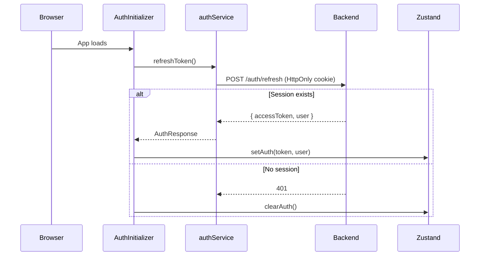

# MusicShop Frontend Architecture Analysis

## Tech Stack Overview

| Category | Technology | Version |
|---|---|---|
| **Runtime** | React | 19.2.4 |
| **Language** | TypeScript | 5.x (`strict: true`) |
| **Build Tool** | Vite | 8.x |
| **Styling** | TailwindCSS v4 + shadcn/ui (base-nova style) |
| **Server State** | TanStack Query (React Query) | 5.x |
| **Client State** | Zustand | 5.x |
| **Forms** | React Hook Form + `@hookform/resolvers` |
| **Validation** | Zod | 3.x |
| **HTTP Client** | Axios + `axios-auth-refresh` |
| **Routing** | React Router DOM | 7.x |
| **3D Rendering** | Three.js + React Three Fiber + Drei + Postprocessing |
| **Auth** | Google OAuth (`@react-oauth/google`) + JWT |
| **Icons** | Lucide React |
| **Notifications** | Sonner (toast) |
| **Testing** | Vitest + Storybook 10 + Playwright |
| **Deployment** | Docker + Nginx |

---

## Project Structure

The project follows a **feature-sliced** architecture — not the canonical `src/components/hooks/services` flat layout, but a hybrid that groups code by domain feature while keeping shared infrastructure in `shared/`.

```
src/
├── app/                  # Application shell (entry point, routing, global CSS)
│   ├── main.tsx          # React root, provider tree
│   ├── App.tsx           # Route definitions
│   └── index.css         # Global styles / Tailwind directives
├── features/             # Feature modules (domain-scoped)
│   ├── auth/             # Login, register, Google OAuth, token refresh
│   ├── cart/             # Shopping cart (drawer UI + local state)
│   ├── catalog/          # Admin CRUD: artists, genres, labels, releases
│   ├── checkout/         # Checkout flow
│   ├── curation/         # Curated collections
│   ├── orders/           # Order history + admin order management
│   ├── payments/         # Stripe payment types
│   ├── products/         # Product listing + detail
│   └── threejs/          # 3D hero scene (Three.js + R3F)
├── layouts/              # Layout shells (Shop, Auth, Admin)
├── pages/                # Thin route-level components
│   ├── admin/            # Admin pages (delegate to feature components)
│   ├── auth/             # Login/Register pages
│   └── shop/             # Storefront pages
├── shared/               # Cross-cutting infrastructure
│   ├── api/              # Axios instance, token store
│   ├── components/       # ui/ (shadcn primitives) + common/ (ImageUpload, etc.)
│   ├── hooks/            # Global hooks (useImageUpload, useAuthRedirect)
│   ├── lib/              # Utility functions (cn, clsx merges)
│   ├── services/         # Shared services (upload)
│   └── types/            # Shared TypeScript types (ApiResponse, PaginatedResponse)
├── store/                # Global Zustand stores
├── widgets/              # Composite UI blocks (Navbar)
└── stories/              # Storybook stories
```

### Each feature module follows a consistent internal structure:

```
features/<feature>/
├── components/       # React components (presentational)
├── hooks/            # Business logic hooks
├── services/         # API service objects
├── types/            # Feature-specific TypeScript interfaces
├── schemas.ts        # Zod validation schemas (when applicable)
└── index.ts          # Public barrel export
```

---

## Core Architectural Patterns

### 1. Hook + Presentational Component Separation

Every feature component strictly separates **logic** (hook) from **rendering** (component). The hook owns all state, mutations, and handlers. The component receives everything from the hook and renders pure JSX.

**Hook layer** — [useGenreManagement.ts](file:///d:/CatMusicShop/MusicShop/src/musicshop-web/src/features/catalog/hooks/useGenreManagement.ts):
- Manages pagination, debounced search, URL sync via `useSearchParams`
- Delegates data fetching to `useGenres()` (TanStack Query wrapper)
- Returns a structured object: `{ genres, isLoading, isEmpty, page, form, actions }`

**Component layer** — consumes the hook, renders data. Zero business logic in JSX.

**Page layer** — thin shell, ~6 LOC:
```tsx
// pages/admin/GenreManagementPage.tsx
export default function GenreManagementPage() {
  return <GenreManagement />;
}
```

### 2. Service Layer (Plain Objects, Not Classes)

Services are stateless object literals with typed async functions. All HTTP goes through the centralized [axiosInstance](file:///d:/CatMusicShop/MusicShop/src/musicshop-web/src/shared/api/axiosInstance.ts). No component ever calls Axios directly.

```
Component → Hook → TanStack Query → Service → axiosInstance → Backend API
```

### 3. State Management Strategy

| State Type | Tool | Example |
|---|---|---|
| **Server state** | TanStack Query | Product lists, genres, orders |
| **Global client state** | Zustand | Auth state (`useAuthStore`) |
| **Feature-local UI state** | Zustand (scoped) | Cart drawer open/close (`useCartUIStore`) |
| **Component-local UI state** | `useState` | Form visibility, hover states |

Server and client state are **never mixed** in the same store.

---

## API Layer Architecture

### Axios Instance ([axiosInstance.ts](file:///d:/CatMusicShop/MusicShop/src/musicshop-web/src/shared/api/axiosInstance.ts))

Custom `AppAxiosInstance` type that reflects response interceptor behavior — methods return `T` directly instead of `AxiosResponse<T>`.

**Key behaviors:**
- **Request interceptor**: Attaches `Bearer` token from in-memory `tokenStore`
- **Response interceptor**: Unwraps `response.data` automatically; normalizes errors from RFC 7807 `ProblemDetails`
- **Token refresh**: Uses `axios-auth-refresh` with a singleton promise pattern to handle concurrent 401s — only one refresh request fires, all queued requests retry after it resolves
- **Base URL**: Configurable via `VITE_API_URL` env var, defaults to `http://localhost:5000/api/v1`
- **Proxy**: Vite dev server proxies `/api` to `http://localhost:5000`

### Token Storage ([tokenStore.ts](file:///d:/CatMusicShop/MusicShop/src/musicshop-web/src/shared/api/tokenStore.ts))

Access token stored **in-memory only** (closure variable) — not `localStorage`, not cookies. This prevents XSS token theft. The refresh token lives in an HttpOnly cookie managed by the backend.

---

## Authentication Flow



- [AuthInitializer](file:///d:/CatMusicShop/MusicShop/src/musicshop-web/src/features/auth/components/AuthInitializer.tsx) wraps the entire app in `main.tsx` — performs silent token refresh on mount
- Google OAuth supported via `@react-oauth/google` provider
- `AdminRoute` component gates admin routes based on user role
- On 401 after failed refresh: `axiosInstance.onUnauthorized` callback clears auth + navigates to `/login`

---

## 3D Rendering (Three.js Feature)

The homepage hero section uses a full **React Three Fiber** scene:

| Component | Purpose |
|---|---|
| [MusicHeroScene](file:///d:/CatMusicShop/MusicShop/src/musicshop-web/src/features/threejs/components/MusicHeroScene.tsx) | Main Canvas with camera, lights, sky, post-processing |
| [Model](file:///d:/CatMusicShop/MusicShop/src/musicshop-web/src/features/threejs/components/Model.tsx) | Generic GLB/GLTF model loader |
| [HeroText](file:///d:/CatMusicShop/MusicShop/src/musicshop-web/src/features/threejs/components/HeroText.tsx) | 3D text rendered in the scene |
| [Particles](file:///d:/CatMusicShop/MusicShop/src/musicshop-web/src/features/threejs/components/Particles.tsx) | Ambient particle effects |
| [ArtistFloatingImages](file:///d:/CatMusicShop/MusicShop/src/musicshop-web/src/features/threejs/components/ArtistFloatingImages.tsx) | Floating artist artwork planes |

Uses `@react-three/postprocessing` for **Bloom** effects. Responsive — adjusts camera FOV and position for mobile breakpoints. Custom scroll-zoom boundary handling prevents the 3D scene from stealing page scroll.

---

## UI Component System

### shadcn/ui (base-nova style)
Primitives in [shared/components/ui/](file:///d:/CatMusicShop/MusicShop/src/musicshop-web/src/shared/components/ui): Button, Card, Input, Label, Badge, Alert, Checkbox, Pagination, Skeleton, Slider.

### Common Components
Composite reusable components in [shared/components/common/](file:///d:/CatMusicShop/MusicShop/src/musicshop-web/src/shared/components/common):
- `ImageUpload` — file upload with preview
- `ManagementLayout` — standardized admin CRUD layout (search, pagination, table shell)
- `PageHeader` — consistent page header

### Styling
- TailwindCSS v4 with `@tailwindcss/postcss`
- CSS variables for theming (`bg-background`, `text-foreground`, `border-border`)
- `class-variance-authority` + `clsx` + `tailwind-merge` for component variants

---

## Routing Architecture

Three layout groups via nested `<Route>` elements:

| Layout | Path Prefix | Guard |
|---|---|---|
| `ShopLayout` | `/` | None (public) |
| `AuthLayout` | `/login`, `/register` | Redirect to `/` if authenticated |
| `AdminLayout` | `/admin/*` | `AdminRoute` (role-based) |

Protected shop routes (`/checkout`, `/profile`, `/orders`) use inline `accessToken` checks with `<Navigate>`.

---

## Testing Infrastructure

- **Vitest** for unit testing with V8 coverage
- **Storybook 10** with `@storybook/react-vite` — includes `addon-vitest` for component testing
- **Playwright** as the browser provider for Storybook interaction tests
- **Chromatic** integration for visual regression testing

---

## Deployment

- **Dockerfile**: Multi-stage build (Node for build, Nginx for serve)
- **Nginx**: Custom [nginx.conf](file:///d:/CatMusicShop/MusicShop/src/musicshop-web/nginx.conf) for SPA routing (try_files fallback to `index.html`)
- **Environment**: `VITE_API_URL` and `VITE_GOOGLE_CLIENT_ID` injected at build time

---

## TanStack Query Configuration

[queryClient.ts](file:///d:/CatMusicShop/MusicShop/src/musicshop-web/src/lib/queryClient.ts):
- `staleTime`: 60s — data considered fresh for 1 minute
- `retry`: 1 attempt on failure
- `refetchOnWindowFocus`: enabled
- Global `QueryCache` and `MutationCache` error handlers log RFC 7807 `ProblemDetails` errors
